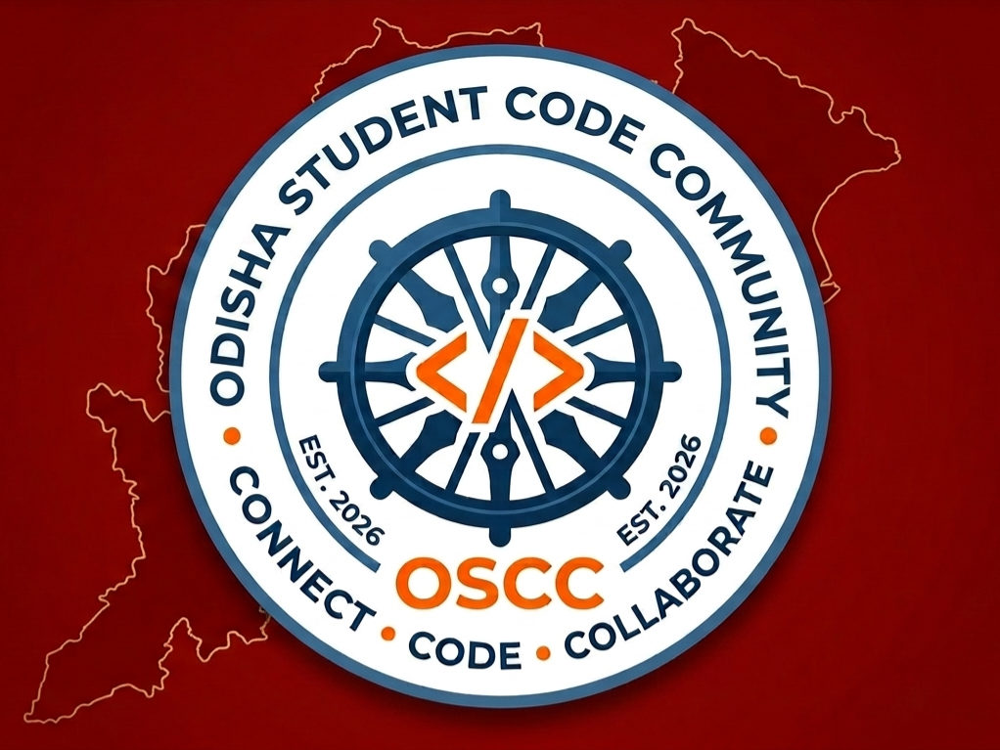

# Odisha Students Code Community (OSCC) Official Website ❤️

> **Students in Odisha building software together — in public.**

[](https://odisha-students-code-community.github.io/)

Welcome to the official repository for the **Odisha Students Code Community (OSCC)** website, hosted at [odisha-students-code-community.github.io](https://odisha-students-code-community.github.io/).

OSCC is a student-driven, 100% free open-source technology movement connecting student developers, designers, and enthusiasts across colleges and polytechnics in Odisha, India.

---

## 🛠️ Tech Stack & Architecture

This website is engineered with an **Industrial Brutalism / Neo-Brutalist** aesthetic without heavyweight frontend frameworks or node build steps:

- **Markup**: Semantic HTML5 (WAI-ARIA accessible, WCAG AA compliant).
- **Styling**: Modular CSS3 with CSS Custom Properties (`css/tokens.css`, `base.css`, `components.css`, `layout.css`, `responsive.css`).
- **Scripts**: Clean ES6+ JavaScript modules (`js/app.js`, `js/projects-filter.js`, `js/github-api.js`).
- **Typography**: Space Grotesk (Display), JetBrains Mono (Technical/Code), Inter (Body).
- **Hosting**: GitHub Pages (100% static, fast, zero runtime maintenance).

---

## 📁 Repository Structure

```text
Odisha-Students-Code-Community.github.io/
├── index.html              # Main OSCC homepage
├── 404.html                # Custom industrial 404 handler
├── .nojekyll               # Disables Jekyll processing on GitHub Pages
├── .gitignore              # Ignores local prompts & environment files
├── robots.txt              # Search engine crawler directives
├── sitemap.xml             # XML sitemap for SEO indexing
├── LICENSE                 # MIT License
├── README.md               # Repository documentation
├── CONTRIBUTING.md         # Student contribution guidelines
├── CODE_OF_CONDUCT.md     # Community code of conduct
├── .github/
│   ├── ISSUE_TEMPLATE/     # Bug report, feature request & project proposals
│   └── PULL_REQUEST_TEMPLATE.md
├── pages/                  # Dedicated multi-page directory
│   ├── projects.html       # Open source project directory & filter
│   ├── contribute.html     # Beginner-friendly 9-step Git guide
│   ├── community.html      # Values, college leads & safety charter
│   └── events.html         # Schedule board & workshop proposal guide
├── assets/
│   └── icons/              # Official OSCC brand assets (Logo & Full Banner)
├── css/                    # Industrial Brutalism design system tokens & layouts
│   ├── tokens.css, base.css, components.css, layout.css, responsive.css
└── js/                     # Data layer, GitHub API cache & runtime controllers
    ├── app.js, github-api.js, projects-filter.js
    └── data/ (config.js, projects.js, community.js, events.js)
```

---

## 🚀 Local Development Setup

No `npm install` or compilation step is required! You only need a web browser and a lightweight local HTTP server.

### Option 1: Python HTTP Server (Recommended)
```bash
# Clone your fork
git clone https://github.com/YOUR_USERNAME/Odisha-Students-Code-Community.github.io.git
cd Odisha-Students-Code-Community.github.io

# Start local server
python -m http.server 8000
```
Open [http://localhost:8000](http://localhost:8000) in your web browser.

### Option 2: VS Code Live Server
1. Open the repository folder in **VS Code**.
2. Install the **Live Server** extension.
3. Right-click `index.html` and select **"Open with Live Server"**.

---

## 🎯 How to Contribute

We actively encourage students to make their **first open-source contribution** here!

1. Check our [Issues](https://github.com/Odisha-Students-Code-Community/Odisha-Students-Code-Community.github.io/issues) for `good first issue` tags.
2. Read our comprehensive [CONTRIBUTING.md](CONTRIBUTING.md) guide.
3. Fork the repository, create a branch (`git checkout -b feat/your-feature`), and test your changes locally.
4. Open a Pull Request! A friendly maintainer will review your work and help you merge it.

---

## 📜 Code of Conduct & Safety

OSCC is a safe, inclusive, and harassment-free community for all student developers regardless of background, gender, or experience level. Read our full [CODE_OF_CONDUCT.md](CODE_OF_CONDUCT.md).

- **100% Free**: OSCC has no admission fees, paid memberships, or hidden charges.
- **No Scams**: We do not promote spam internships or paid certificates.

---

## 📄 License

This repository and all website source code are released under the [MIT License](LICENSE).
Odisha Students Code Community ❤️
